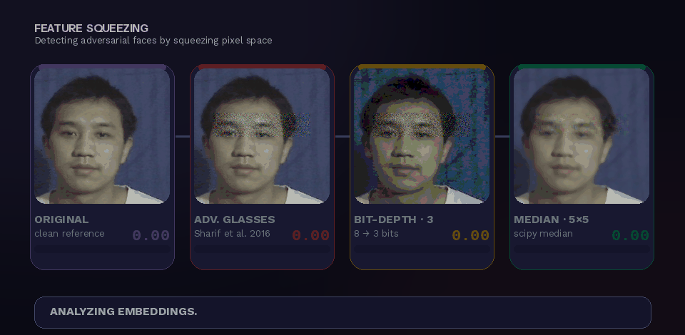
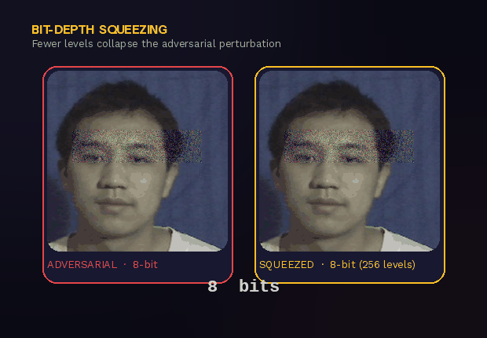

<div align="center">

# 🛡️ Feature Squeezing — Live Adversarial-Defense Demo

### Watch an adversarial-glasses attack break face recognition — then watch a one-line defense catch it.

<br/>



<br/><br/>

[](https://huggingface.co/spaces/eyalsht/feature-squeezing-demo)
&nbsp;
[](docs/adr/ADR-001-python-3.13.md)
&nbsp;
[](https://www.gradio.app/)
&nbsp;
[](#-license)

<sub>ArcFace · InsightFace · ONNX Runtime · NumPy · SciPy — runs on a free CPU tier, no GPU required.</sub>

</div>

---

## ✨ What this is

An interactive, single-URL web app that tells the **attack-vs-defense** story between two landmark papers in one screen:

> **Original face** → recognized ✅ → **adversarial glasses** overlay → recognition collapses ❌ → **Feature Squeezing** measures the embedding shift → 🚨 **ADVERSARIAL DETECTED**.

| | |
|---|---|
| ⚔️ **The attack** | *Accessorize to a Crime* (Sharif et al., **CCS 2016**) — adversarial eyeglass perturbations that fool face recognition. |
| 🛡️ **The defense** | *Feature Squeezing* (Xu et al., **NDSS 2018**) — squeeze the pixel space, re-embed, and flag inputs whose embedding moves too far. |
| 🧠 **The model** | **ArcFace** (`buffalo_l`) via InsightFace, on ONNX Runtime (CPU). |

Built as the companion artefact for a **HUP Seminar** talk on adversarial ML.

---

## 🎬 How the defense works

The core insight: a clean image and its *squeezed* version embed to almost the same point — but an **adversarial** image and its squeezed version drift far apart. That drift is the tell.

<div align="center">

</div>

```text
              ┌─────────────┐
   input ────▶│   ArcFace   │────▶  embedding  e
      │       └─────────────┘
      │
      │       ┌─────────────┐      ┌─────────────┐
      └──────▶│   squeeze   │─────▶│   ArcFace   │────▶  embedding  e'
              │ bit / median│      └─────────────┘
              └─────────────┘

   shift = max(‖e − e'_bit‖, ‖e − e'_median‖)
   verdict = 🚨 ADVERSARIAL   if  shift > 0.50
             ✅ CLEAN          otherwise
```

Two squeezers ship in the demo (see [ADR-006](docs/adr/ADR-006-two-squeezers.md)):

| Squeezer | What it does | Why it kills the attack |
|---|---|---|
| **Bit-Depth** | Quantises each channel to `2ⁿ` levels (1–8 bits) | Adversarial noise lives in the low bits — drop them and it's gone |
| **Median Filter** | `k×k` median over each channel (3/5/7) | Smooths the high-frequency perturbation while preserving facial structure |

---

## 🕹️ The app

**Tab 1 — Pipeline Demo.** Pick an identity (or register your own face), hit **⚔ Launch Attack**, then **🛡 Squeeze + Detect**. A four-panel strip shows *Original → Adv. Glasses → Bit-Squeezed → Median-Filtered*, each scored by cosine similarity to the target, with a live verdict banner.

**Tab 2 — Verify Identity.** Upload two photos of the same person and watch the three-row story unfold:

```
✅  clean A      vs  clean B            →  SAME PERSON
❌  clean A      vs  attacked B         →  IDENTITY LOST
✅  clean A      vs  squeezed-attacked  →  IDENTITY RECOVERED
```

---

## 🚀 Run it locally

> **Prereq (Windows):** Microsoft Visual C++ Build Tools — *"Desktop development with C++"* — to compile InsightFace. See [ADR-001](docs/adr/ADR-001-python-3.13.md#consequences).

```powershell
py -3.13 -m venv .venv
.\.venv\Scripts\Activate.ps1
.\scripts\dev.ps1 install      # install dependencies
.\scripts\dev.ps1 dataset      # one-time: fetch the demo faces
.\scripts\dev.ps1 app          # launch Gradio on http://localhost:7860
```

```powershell
.\scripts\dev.ps1 test         # pytest -v
.\scripts\dev.ps1 smoke        # install + test + import sanity
```

First launch downloads ~300 MB of ArcFace weights to `~/.insightface/` (cached afterward, ~3–4 min).

---

## 🧱 Architecture

```
app.py                 ← Gradio Blocks UI (HF Spaces entry point, must stay at root)
src/
├── squeezers.py       BitDepthSqueezer · MedianFilterSqueezer · NonLocalMeansSqueezer
├── attack.py          Face · GlassesAttacker · make_glasses_mask
├── detector.py        FaceDetector · ArcFaceEmbedder · SqueezeDetector · DetectionResult
└── dataset.py         Identity · IdentityDatabase (session-scoped, no persistence)
tests/                 ← pytest suite (TDD; pythonpath = src)
dataset/               ← demo face images
docs/                  ← ADRs · product spec · implementation plan · assets
```

**Stack:** Python 3.13 · Gradio 4.x (Blocks) · InsightFace (ArcFace `buffalo_l`) · ONNX Runtime (CPU) · NumPy · SciPy · Pillow · pytest.

> 💡 The README GIFs are generated from the real demo faces by [`docs/assets/build_gifs.py`](docs/assets/build_gifs.py) — pure Pillow + NumPy, no model download needed.

---

## 📚 References

- M. Sharif, S. Bhagavatula, L. Bauer, M. K. Reiter. **Accessorize to a Crime: Real and Stealthy Attacks on State-of-the-Art Face Recognition.** *ACM CCS 2016.*
- W. Xu, D. Evans, Y. Qi. **Feature Squeezing: Detecting Adversarial Examples in Deep Neural Networks.** *NDSS 2018.*
- J. Deng, J. Guo, N. Xue, S. Zafeiriou. **ArcFace: Additive Angular Margin Loss for Deep Face Recognition.** *CVPR 2019.*

---

## 📄 License

Released under the **MIT License**.

<div align="center">
<sub>Built for the HUP Seminar by <b>imree</b> &amp; <b>Eyal</b> · adversarial attacks meet a remarkably simple defense.</sub>
</div>
